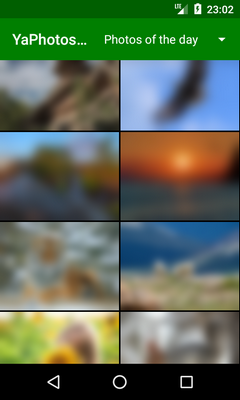
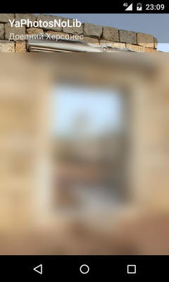

# YaPhotosNoLib

Sample Android app to demonstrate usage of Yandex.Fotki API.

Displays three public photo albums: "Recent photos", "Popular photos" and "Photos of the day".

This version of [YaPhotos](https://github.com/gmk57/ya-photos) does not use any libraries, so app size is very small (< 70 Kb).

    

## Features

- Album view:
  - Dropdown menu navigation
  - Thumbnails caching and preloading (with lower priority)
  - Endless scrolling
  - Thumbnail size and column number auto-adjusted to screen size
  - Progress and error indicators
- Detail view:
  - Fullscreen mode
  - Image size auto-adjusted to screen size
  - Progress and error indicators
- Workaround to calculate next page for "Photos of the day" album

## Technologies used

- AsyncTask
- AsyncTaskLoader
- Date, Calendar, SimpleDateFormat
- Fragment, FragmentManager
- GridView, ArrayAdapter
- HandlerThread, Handler, Message
- HttpURLConnection
- JSONObject, JSONArray
- LruCache
- SharedPreferences
- StrictMode

## Installation

This is an Android Studio project.

## License

Project is distributed under MIT license.

The use of Yandex.Fotki service and its API is regulated by [API User Agreement](https://yandex.ru/legal/fotki_api/), [Yandex.Fotki Service Terms Of Use](https://yandex.ru/legal/fotki_termsofuse/) and general [User Agreement for Yandex Services](https://yandex.com/legal/rules/).

All photos are exclusive property of their right holders, available for personal non-commercial use under certain conditions (see links above).